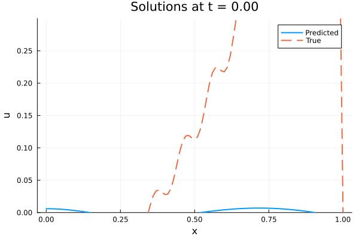
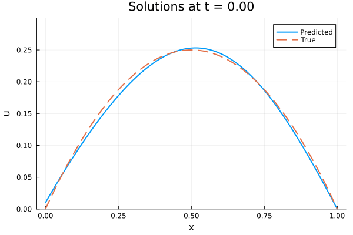

# 🧠 Solving the 1D Wave Equation using Physics-Informed Neural Networks (PINNs) in Julia

This project demonstrates how to solve the classic 1D wave equation using **Physics-Informed Neural Networks (PINNs)** with [NeuralPDE.jl](https://github.com/SciML/NeuralPDE.jl). Instead of relying on traditional numerical methods like finite differences, we train a neural network to approximate the solution directly.

<p align="center">
  
</p>

## 🧩 Problem Formulation

We solve the 1D wave equation:

\[
\frac{\partial^2 u}{\partial t^2} = c^2 \frac{\partial^2 u}{\partial x^2}
\]

With the following conditions:

- Initial:  \( u(x,0) = x(1 - x) \), \( u_t(x,0) = 0 \)
- Boundary: \( u(0,t) = 0 \), \( u(1,t) = 0 \)
- Domain: \( x \in [0,1],\ t \in [0,1] \)
- Speed: \( c = 1 \)

---

## 🔧 Methodology

- Defined PDE, initial and boundary conditions using `NeuralPDE.jl`
- Constructed a fully-connected neural network (MLP) using `Lux.jl`
- Trained using `Optimization.jl` with `Adam` optimizer in two phases
  - Phase 1: Coarse optimization with dropout and high learning rate
  - Phase 2: Fine-tuning after removing dropout and lowering the learning rate
- Visualized and compared the neural network prediction with the analytical solution

---

## 🎯 Challenges & Fixes

| Challenge | Fix |
|----------|-----|
| Loss ~0.02 but poor prediction | Removed `Dropout` after initial training to reduce noise |
| Low loss but poor generalization | Increased network width (neurons per layer) |
| Unstable training | Tuned learning rate and trained in two stages |

---

## 📈 Results

### 🔻 Before Optimization (high loss ~0.02)
<p align="center">
  
</p>

### ✅ Final Prediction (low loss ~0.0001)
<p align="center">
  
</p>

---

## 📄 Report

Full derivations, experiment notes, and plots can be found in the [project report](report/1d_wave_pinn_report.pdf).

---

## 🚀 Getting Started

### 🛠️ Dependencies

Install Julia and add the following packages:

```julia
using Pkg
Pkg.add(["NeuralPDE", "Lux", "LuxCUDA", "ComponentArrays", "Optimization", "OptimizationOptimisers", "Plots"])
```

### ▶️ Run the Code

Simply run:

```julia
include("wave_pinn.jl")
```

This will:
- Define the PDE system
- Train the neural network
- Generate solution animations (`media/*.gif`)

---

## 📚 References

- [NeuralPDE.jl Docs](https://neuralpde.sciml.ai/stable/)
- [Physics-Informed Neural Networks (Raissi et al., 2019)](https://arxiv.org/abs/1711.10561)

---
